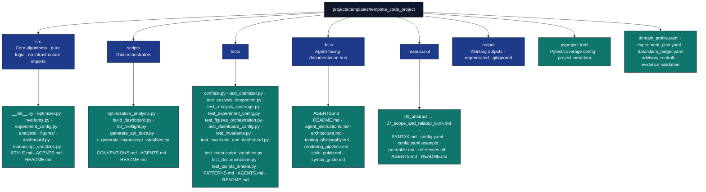

# Code Project - Optimization Research Exemplar

**This is an active project** in the `projects/` directory, discovered and executed by infrastructure discovery functions. Public exemplar roster and comparison: [`projects/AGENTS.md`](../../AGENTS.md#permanent-canonical-exemplars-and-optional-search-add-on). Publication DOI layout: [`docs/guides/zenodo-doi-strategy.md`](../../../docs/guides/zenodo-doi-strategy.md). Manuscript semantics: [`docs/guides/manuscript-semantics.md`](../../../docs/guides/manuscript-semantics.md).

Decision memory and verifier hardening follow [`docs/rules/memory_and_decision_records.md`](../../../docs/rules/memory_and_decision_records.md): use nearby `WHY:` comments only for surprising local choices, keep volatile counts generated, and add negative controls for verifier-like gates.

## Layer contract

| Surface | Rule |
| --- | --- |
| `src/` (domain) | Pure optimization, figures, dashboard payload — **no** direct `infrastructure` imports |
| `src/analysis/_infra.py`, `src/_runtime.py` | Optional monorepo adapters only (logging, publishing, figure registry, dashboard shell) |
| `scripts/` | Thin orchestrators; may import `infrastructure/` and `src/` |
| Live counts | Link [`docs/_generated/COUNTS.md`](../../../docs/_generated/COUNTS.md); do not hardcode measured test totals or coverage % |

Enforced by `check_project_src_infrastructure_boundary` via `scripts/check_template_drift.py --strict` and `manuscript/layer_contract.yaml`.

## Overview

A research project exemplifying mathematical optimization algorithms with rigorous implementation, extensive testing, and publication-quality analysis. This project demonstrates the template's full capabilities for computational research, including automated figure generation, reproducible results, and professional manuscript production.

## Key Features & Capabilities

### Mathematical Optimization

- **Gradient Descent Implementation**: Full algorithm with convergence analysis
- **Theoretical Convergence Bounds**: Rigorous mathematical analysis of convergence rates
- **Numerical Stability**: Robust implementation with proper error handling
- **Performance Characterization**: Comprehensive benchmarking and timing analysis

### Research Quality Assurance

- **Test suite**: covers edge cases, stability analysis, performance benchmarks, dashboard invariants, and full dashboard build; `projects/templates/template_code_project/src/` measures well above the 90% minimum gate enforced by both the project `pyproject.toml` and the root pipeline. Live test count + achieved coverage: [`docs/_generated/COUNTS.md`](../../../docs/_generated/COUNTS.md).
- **Deterministic algorithms**: Reproducible results; tests avoid nondeterministic RNG unless documented (see `docs/agent_instructions.md`)
- **Documentation**: Complete type hints, docstrings, and examples
- **Parameter Validation**: Robust input checking and error handling

### Publication-Ready Output

- **Professional Visualizations**: Automated figure generation with proper labeling and styling
- **Manuscript with Cross-References**: LaTeX-rendered PDF with equation numbering and citations
- **Automated Analysis Pipeline**: Script-driven data generation and visualization
- **Executive Reporting**: Multi-project comparative analysis capabilities

### Production publishing (`docxology/template_code_project`)

Double publish (Zenodo + GitHub) via `scripts/publish_project_release.py`. Manuscript config enables transmission bookends, steganography profile documentation, and metadata-driven deposit filenames (`Author_2026_Convergence_{hash8}.pdf` — local working PDF remains `template_code_project_combined.pdf`).

Current release/DOI records are generated from `manuscript/config.yaml`, `CITATION.cff`, `.zenodo.json`, GitHub, and Zenodo into [`docs/_generated/publication_records.md`](../../../docs/_generated/publication_records.md). Do not copy per-version DOI rows here.

Workflow reference: [`docs/guides/publishing-guide.md`](../../../docs/guides/publishing-guide.md) (transmission bookends + deposit filename sections). Render/stego path: [`docs/rendering_pipeline.md`](docs/rendering_pipeline.md).

### Scientific Validation & Analysis

- **Numerical Stability Assessment**: Automated stability testing across input ranges
- **Performance Benchmarking**: Execution time and memory usage analysis
- **Reporting Dashboard**: Interactive HTML reports with analysis metrics
- **Progress Tracking**: Real-time monitoring with visual progress indicators
- **Performance Monitoring**: Resource usage tracking during analysis

### Infrastructure Integration

- **Advanced Error Handling**: Comprehensive exception handling with recovery suggestions
- **Structured Logging**: Infrastructure-backed logging with operation timing and context
- **Publishing Tools Integration**: Automated citation generation and publication metadata extraction
- **Context Manager Performance Monitoring**: Proper resource usage tracking with detailed metrics
- **Progress Bars**: Visual progress indicators for long-running optimization experiments

## Directory Structure



## Installation/Setup

Install dependencies from the **repository root** with `uv sync` (see root [`pyproject.toml`](../../../pyproject.toml)). The root `[tool.uv.workspace]` has `members = []`, so this directory is not a separate uv workspace package; [`projects/templates/template_code_project/pyproject.toml`](pyproject.toml) still pins **pytest/coverage** settings, documents the project name, and lists scientific dependencies used when running tools against this tree in isolation.

## Usage Examples

### Basic Optimization

```python
from src.optimizer import gradient_descent, quadratic_function, compute_gradient
from infrastructure.core.logging.utils import get_logger
import numpy as np

logger = get_logger(__name__)

# Run gradient descent
result = gradient_descent(
    initial_point=np.array([5.0]),
    objective_func=quadratic_function,
    gradient_func=compute_gradient,
    step_size=0.1,
    tolerance=1e-6
)
logger.info("Solution: %s, Converged: %s", result.solution, result.converged)
logger.info("Iterations: %s, Final objective: %s", result.iterations, result.objective_value)
```

### Analysis Pipeline

```bash
# From repository root — execute the full analysis pipeline
uv run python projects/templates/template_code_project/scripts/optimization_analysis.py
# Writes figures, data, reports, and dashboard under projects/templates/template_code_project/output/
```

### Manuscript variable hydration (strict default)

`scripts/z_generate_manuscript_variables.py` calls `generate_variables(..., require_analysis_outputs=True)` by default and fails when `output/data/optimization_results.csv` is absent. Pass `--allow-draft` only for intentional early drafts that may use `"N/A"` fallbacks for result-derived tokens.

```bash
uv run python projects/templates/template_code_project/scripts/z_generate_manuscript_variables.py
# Draft-only (skip analysis CSV requirement):
uv run python projects/templates/template_code_project/scripts/z_generate_manuscript_variables.py --allow-draft
```

### Scientific Analysis Features

```python
from scripts.optimization_analysis import run_stability_analysis, run_performance_benchmarking

# Assess numerical stability
stability_path = run_stability_analysis()
# Generates stability analysis report and visualization

# Run performance benchmarking
benchmark_path = run_performance_benchmarking()
# Generates performance metrics and comparison plots

# Access dashboard (Plotly)
# Generated at output/web/dashboard.html via scripts/build_dashboard.py
```

## Configuration

The project uses the template's configuration system via `pyproject.toml`,
manuscript `config.yaml`, and environment variables. Advisory agentic-research
controls are declarative: `domain_profile.yaml` declares review gates, source
policy, artifact expectations, and benchmark rubric preferences;
`experiment_plan.yaml` declares the gradient-descent conditions, primary metric,
expected figures/tables, baseline, and ablation; `data/claim_ledger.yaml`
registers sourced numeric claims for evidence-registry validation. These
overlays are validation inputs only; they do not execute autonomous agents.

## Protocol for AI Agents

**Critical Directive**: Before modifying this project, AI agents *must* reference the specific behavioral rules laid out in the `docs/` folder:

- Start with `projects/templates/template_code_project/docs/agent_instructions.md` to understand operational constraints.
- Consult `projects/templates/template_code_project/docs/testing_philosophy.md` before writing or modifying any `pytest` files.
- Consult `projects/templates/template_code_project/docs/architecture.md` before altering `scripts/` or `src/` modular boundaries.

## Testing

```bash
# Run project tests
uv run pytest projects/templates/template_code_project/tests/ -v

# With coverage
uv run pytest projects/templates/template_code_project/tests/ --cov=projects/templates/template_code_project/src --cov-report=html
```

## API Reference

### optimizer.py

#### OptimizationResult (dataclass)

```python
@dataclass
class OptimizationResult:
    """Container for optimization algorithm results."""
    solution: np.ndarray          # Optimal point found
    objective_value: float        # Function value at solution
    iterations: int               # Number of iterations performed
    converged: bool               # Whether algorithm converged
    gradient_norm: float          # Final gradient norm
    objective_history: Optional[list[float]] = None  # Objective values per iteration
```

#### quadratic_function (function)

```python
def quadratic_function(
    x: np.ndarray,
    A: Optional[np.ndarray] = None,
    b: Optional[np.ndarray] = None
) -> float:
    """Evaluate quadratic objective f(x) = (1/2) x^T A x - b^T x.

    Args:
        x: Input parameter array
        A: Quadratic coefficient matrix (defaults to identity)
        b: Linear term vector (defaults to ones)

    Returns:
        Function value
    """
```

#### compute_gradient (function)

```python
def compute_gradient(
    x: np.ndarray,
    A: Optional[np.ndarray] = None,
    b: Optional[np.ndarray] = None
) -> np.ndarray:
    """Compute analytical gradient ∇f(x) = Ax - b.

    Args:
        x: Input parameter array
        A: Quadratic coefficient matrix (defaults to identity)
        b: Linear term vector (defaults to ones)

    Returns:
        Gradient vector
    """
```

#### gradient_descent (function)

```python
def gradient_descent(
    initial_point: np.ndarray,
    objective_func: Callable[[np.ndarray], float],
    gradient_func: Callable[[np.ndarray], np.ndarray],
    max_iterations: int = 1000,
    tolerance: float = 1e-6,
    step_size: float = 0.01,
    verbose: bool = False,
) -> OptimizationResult:
    """Perform gradient descent optimization with fixed step size.

    Args:
        initial_point: Starting point for optimization
        objective_func: Objective function to minimize
        gradient_func: Gradient function
        max_iterations: Maximum number of iterations
        tolerance: Convergence tolerance on gradient norm
        step_size: Fixed step size (learning rate)
        verbose: Enable verbose logging

    Returns:
        OptimizationResult with solution and diagnostics
    """
```

#### make_quadratic_problem (function)

```python
def make_quadratic_problem(
    A: np.ndarray | None = None,
    b: np.ndarray | None = None,
) -> tuple[Callable[[np.ndarray], float], Callable[[np.ndarray], np.ndarray]]:
    """Return (objective, gradient) callables for a quadratic problem."""
```

#### simulate_trajectory (function)

```python
def simulate_trajectory(
    step_size: float,
    max_iter: int = 50,
    A: np.ndarray | None = None,
    b: np.ndarray | None = None,
    initial_point: np.ndarray | None = None,
) -> dict[str, list]:
    """Run gradient_descent and return iteration/objective history for plotting."""
```

### optimization_analysis.py

Thin orchestrator (~65 lines) — runs the full pipeline via `main()`. **Function signatures:** [`src/AGENTS.md`](src/AGENTS.md) (`analysis/`, `figures/`, `optimizer.py`, `dashboard.py`). Do not duplicate API blocks here.

### build_dashboard.py

Thin wrapper → [`src/dashboard.py`](src/dashboard.py).

### generate_api_docs.py

Thin wrapper → [`src/documentation.py`](src/documentation.py).

## Troubleshooting

### Common Issues

- **Import Errors**: Ensure the project is run from the template root directory
- **Missing Dependencies**: Run `uv sync` to install dependencies
- **Test Failures**: Check that numpy/scipy are properly installed

### Known Issues / Learnings

These issues were discovered during development and are documented here for future reference:

1. **`functools.partial` and `__name__`**: The `optimization_analysis.py` script creates `functools.partial` objects via `make_quadratic_problem()`. When passed to `infrastructure/scientific/stability.py` or `benchmarking.py`, these lack `__name__`. The fix uses a `getattr` chain: `getattr(func, "__name__", getattr(getattr(func, "func", None), "__name__", repr(func)))`.

2. **`project_root` must be module-level**: `optimization_analysis.py` originally used `project_root` inside functions but only defined it in `if __name__ == "__main__":`. Fix: define `project_root = Path(__file__).resolve().parent.parent` at module scope.

3. **`conftest.py` is required**: Without `tests/conftest.py` adding `src/` to `sys.path`, pytest cannot import project modules. This is not optional.

4. **`MPLBACKEND=Agg` in conftest**: Without this, matplotlib tests may try to open display windows and hang. Set `os.environ.setdefault("MPLBACKEND", "Agg")` at the top of `conftest.py`.

> **See also**: [New Project Setup Guide](../../../docs/guides/new-project-setup.md) for the full checklist.

This project complies with the template development standards in **[`docs/rules/`](../../../docs/rules/)** and the root **[`.cursorrules`](../../../.cursorrules)** file.

### ✅ **Testing Standards Compliance**

- **90%+ coverage**: live test count and achieved coverage tracked in [`COUNTS.md`](../../../docs/_generated/COUNTS.md); the current suite runs well above the 90% gate
- **Real data only**: All tests use computations, no mocks
- **Full integration**: Tests cover algorithm convergence, stability analysis, and performance benchmarking
- **Deterministic results**: Tests use fixed inputs; any use of random draws should be justified or seeded (see `docs/agent_instructions.md`)
- **Scientific validation**: Includes numerical stability and performance testing

### ✅ **Documentation Standards Compliance**

- **AGENTS.md + README.md**: Complete technical documentation in each directory
- **Type hints**: All public APIs have type annotations
- **Docstrings**: Comprehensive docstrings with examples for all functions
- **Cross-references**: Links between related documentation sections

### ✅ **Type Hints Standards Compliance**

- **Full annotations**: All public functions have type hints
- **Generic types**: Uses `List`, `Dict`, `Optional`, `Callable` appropriately
- **Consistent patterns**: Follows template conventions throughout

### ✅ **Error Handling Standards Compliance**

- **Custom exceptions**: Uses infrastructure exception hierarchy when available
- **Context preservation**: Exception chaining with `from` keyword
- **Informative messages**: Clear error messages with actionable guidance

### ✅ **Logging Standards Compliance**

- **Unified logging**: Uses `infrastructure.core.logging.utils.get_logger(__name__)`
- **Appropriate levels**: DEBUG, INFO, WARNING, ERROR as appropriate
- **Context-rich messages**: Includes relevant context in log messages

### ✅ **Code Style Standards Compliance**

- **Ruff formatting** (`uvx ruff format`): 88-character line length (default alignment), consistent formatting — mirrors CI
- **Descriptive names**: Clear variable and function names
- **Import organization**: Standard library, third-party, local imports properly organized

### Compliance Verification

```bash
# Test coverage verification
uv run pytest projects/templates/template_code_project/tests/ --cov=projects/templates/template_code_project/src --cov-fail-under=90

# Type hint verification
uv run python -c "import ast; import inspect; # Type checking logic here"

# Documentation completeness check
find . -name "*.py" -exec grep -L '"""' {} \;
```

## Infrastructure Features & Examples

### Performance Monitoring

The project uses infrastructure-backed performance monitoring with automatic resource tracking:

```python
# Performance monitoring context manager
from infrastructure.core import monitor_performance

with monitor_performance("Optimization analysis pipeline") as monitor:
    # Run optimization experiments
    results = run_convergence_experiment()

# Access performance metrics
performance_metrics = monitor.stop()
print(f"Duration: {performance_metrics.duration:.2f}s")
print(f"Memory used: {performance_metrics.resource_usage.memory_mb:.1f}MB")
```

**Generated Output:**

```
Performance Summary:
Duration: 2.45s
Memory: 45.2MB
```

### Error Handling

error handling with recovery suggestions:

```python
try:
    # Main analysis pipeline
    results = run_analysis()
except ScriptExecutionError as e:
    print(f"Script execution failed: {e}")
    if e.recovery_commands:
        print("Recovery commands:")
        for cmd in e.recovery_commands:
            print(f"  {cmd}")
except TemplateError as e:
    print(f"Infrastructure error: {e}")
    if e.suggestions:
        print("Suggestions:")
        for suggestion in e.suggestions:
            print(f"  • {suggestion}")
```

### Structured Logging

Infrastructure-backed logging with operation timing:

```python
from infrastructure.core.logging.utils import log_operation, log_success

with log_operation("Running convergence experiments", logger=logger):
    results = run_convergence_experiment()

log_success("Analysis completed successfully!", logger=logger)
```

### Publishing Integration

Automated citation generation and metadata extraction:

```python
from scripts.optimization_analysis import extract_optimization_metadata, generate_citations_from_metadata

# Extract metadata from optimization results
metadata = extract_optimization_metadata(results)

# Generate citations
citations = generate_citations_from_metadata(metadata)

# Access different citation formats
print(citations['bibtex'])  # BibTeX format
print(citations['apa'])     # APA format
print(citations['mla'])     # MLA format
```

**Generated Citations:**

```
@misc{optimization_analysis,
  title={Optimization Algorithm Performance Analysis},
  author={Optimization Analysis Pipeline},
  year={2024}
}
```

### Progress Tracking

Visual progress indicators for long-running operations:

```python
from infrastructure.core.progress import ProgressBar

# Progress tracking for step size experiments
progress = ProgressBar(total=4, task="Step sizes")
for step_size in [0.01, 0.05, 0.1, 0.2]:
    result = run_single_experiment(step_size)
    progress.update(1)
progress.finish()
```

**Console Output:**

```
Step sizes: 100%|██████████████████| 4/4 [00:02<00:00, 1.85it/s]
```

## Best Practices

- Use fixed seeds for reproducible results
- Validate optimization convergence
- Generate multiple random starts for global optimization
- Document parameter choices in manuscript

## See Also

- [Root AGENTS.md](../../AGENTS.md) - Template documentation
- [Publishing guide](../../../docs/guides/publishing-guide.md) · [Zenodo DOI strategy](../../../docs/guides/zenodo-doi-strategy.md) — split `publication.doi` (concept) / `version_doi` layout
- [infrastructure/scientific/](../../../infrastructure/scientific/AGENTS.md) - Scientific utilities
- [`manuscript/SYNTAX.md`](manuscript/SYNTAX.md) — Pandoc citation/cross-reference syntax for this project
- [`../../docs/guides/manuscript-semantics.md`](../../../docs/guides/manuscript-semantics.md) — Repository-wide manuscript semantics
- [`../../AGENTS.md`](../../AGENTS.md#permanent-canonical-exemplars-and-optional-search-add-on) — public exemplar roster
