# Output Directory Conventions

The project-relative `output/` directory (`projects/templates/template_code_project/output/`) holds all generated artifacts from the analysis pipeline. This document describes its structure, regeneration process, and version-control policy.

## Directory Purpose

`output/` is **disposable but regeneratable**. Every file in this directory is produced by a deterministic pipeline script; none should be edited manually. If any file is missing or corrupted, re-run the appropriate pipeline stage to recreate it.

**Key principle:** The source of truth for all outputs is the combination of:
- `src/optimizer.py` (pure mathematical logic)
- `manuscript/config.yaml` (experiment parameters)
- `scripts/optimization_analysis.py` (orchestration)
- `scripts/z_generate_manuscript_variables.py` (token substitution)

## Directory Structure

```mermaid
flowchart TB
    OUT[output/]
    OUT --> FIG[figures/<br/>Publication-quality PNG plots · 300 DPI]
    OUT --> DATA[data/<br/>Numerical results · CSV/JSON]
    OUT --> REP[reports/<br/>Analysis summaries · dashboards]
    OUT --> PDF[pdf/<br/>Final compiled PDF · Pandoc + LaTeX]
    OUT --> WEB[web/<br/>HTML version of the manuscript]
    OUT --> SLIDES[slides/<br/>Beamer slide PDFs per section]
    OUT --> CIT[citations/<br/>Generated citations · APA/BibTeX/MLA]
    OUT --> LOG[logs/<br/>Pipeline execution logs]
    OUT --> MAN[manuscript/<br/>Token-substituted markdown · renderer input]
    OUT --> SIM[simulations/<br/>Optional simulation data]
    OUT --> LLM[llm/<br/>LLM-generated content · if used]

    FIG --> FIG_F[convergence_plot · step_size_sensitivity ·<br/>convergence_rate_comparison · algorithm_complexity ·<br/>performance_benchmark · stability_analysis]
    DATA --> DATA_F[optimization_results.csv ·<br/>manuscript_variables.json · ...]
    REP --> REP_F[stability_analysis.json · performance_benchmark.json ·<br/>output_statistics.json · validation_report.json · telemetry.json]
    PDF --> PDF_F[template_code_project_combined.pdf]
    WEB --> WEB_F[dashboard.html · index.html · section pages...]

    classDef d fill:#0f172a,stroke:#0f172a,color:#fff
    classDef f fill:#0f766e,stroke:#0f172a,color:#fff
    class OUT,FIG,DATA,REP,PDF,WEB,SLIDES,CIT,LOG,MAN,SIM,LLM d
    class FIG_F,DATA_F,REP_F,PDF_F,WEB_F f
```



## Regeneration Sequence

If any artifact becomes corrupted or you change the analysis, follow this sequence:

1. **Clean (optional)**: Delete the entire `output/` directory to start fresh.
   ```bash
   rm -rf projects/templates/template_code_project/output/
   ```

2. **Run analysis pipeline** — generates figures, data, reports, dashboard, and registers figures.
   ```bash
   uv run python projects/templates/template_code_project/scripts/optimization_analysis.py
   ```
   **Outputs**: `figures/`, `data/`, `reports/`, `citations/`, `manuscript/`

3. **Hydrate manuscript variables** — substitutes `{{VARIABLE}}` tokens in all manuscript templates (strict: requires analysis CSV unless `--allow-draft`).
   ```bash
   uv run python projects/templates/template_code_project/scripts/z_generate_manuscript_variables.py
   ```
   **Outputs**: updates `output/manuscript/*.md` (resolved copies) and writes `output/data/manuscript_variables.json`

4. **Render PDF** — converts substituted markdown to PDF via Pandoc/LaTeX.
   ```bash
   uv run python scripts/03_render_pdf.py --project templates/template_code_project
   ```
   **Outputs**: `pdf/`, `slides/`, `web/`

5. **Copy final deliverables** — copies PDF and figures to `output/templates/template_code_project/` (used by CI).
   ```bash
   uv run python scripts/05_copy_outputs.py --project templates/template_code_project
   ```
   **Outputs**: final deliverables at repository-level `output/templates/template_code_project/`

## Version-Control Policy

- **Project `output/` is tracked for this public exemplar** when files stay below the 50 MB public output ceiling. Curated public deliverables are also copied to the repo-level `output/templates/template_code_project/` tree by `scripts/05_copy_outputs.py`.

- **Do not edit files in `output/` manually** — changes will be overwritten on the next pipeline run.

- **When adding a new output file** (e.g., a new figure or data product):
  1. Document it in `docs/output_inventory.md` (this directory's agent guide) with its generator function and path.
  2. Include it in the appropriate pipeline stage (usually `optimization_analysis.py`).
  3. Add a regeneration step to the sequence above if needed.

## Adding a New Output File

To add a new figure or data product:

1. **Add the generator** in `src/figures/` and wire it through `src/analysis/` (script entry: `scripts/optimization_analysis.py`) — write to `output/figures/` or `output/data/` with a fixed, predictable filename.
2. **Update `docs/output_inventory.md`** — add an entry to the file inventory table (see below).
3. **Update manuscript references** — reference the new file via `\\ref{fig:label}` or data table as appropriate.
4. **Re-run the pipeline** (steps 2–5 above).

## File Inventory Template (for `docs/output_inventory.md`)

```markdown
# output/ — Generated Artifacts

| File | Role | Generated By | Phase |
|------|------|--------------|-------|
| output/figures/convergence_plot.png | Gradient descent trajectories | generate_convergence_plot() | 1 |
| output/data/optimization_results.csv | Per-step-size results table | save_optimization_results() | 1 |
| output/manuscript/03_results.md | Resolved results section | z_generate_manuscript_variables.py | 2 |
| output/pdf/template_code_project_combined.pdf | Final publication PDF | 03_render_pdf.py | 3 |
```

## Troubleshooting

- **Missing file**: Identify which phase should generate it and re-run that phase.
- **Stale file**: Delete `output/` and run full pipeline (steps 2–5).
- **Out-of-sync tokens**: If `{{VARIABLE}}` appears in the rendered PDF, re-run phase 2 (variable hydration) and verify `output/data/manuscript_variables.json` contains all required keys.
- **Figure not appearing in PDF**: Verify the PNG exists in `output/figures/` and that `03_results.md` references it with correct relative path (`../output/figures/filename.png`).

## See Also

- [`manuscript/AGENTS.md`](../manuscript/AGENTS.md) — Manuscript modification protocol and token system
- [`rendering_pipeline.md`](rendering_pipeline.md) — Full 4-phase pipeline description
- [`syntax_guide.md`](syntax_guide.md) — Figure references and `{{VARIABLE}}` syntax
