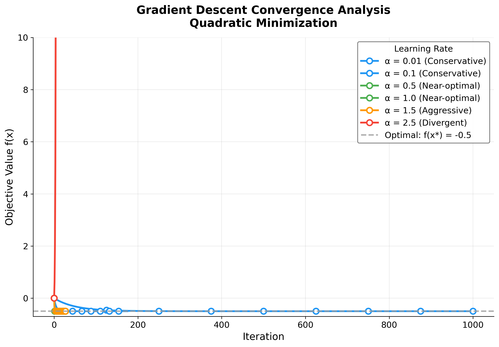

# Manuscript Syntax Reference (template_code_project)

Project-specific overlay on the canonical [`docs/guides/manuscript-semantics.md`](../../../../docs/guides/manuscript-semantics.md) — read that file first; this file documents the **template_code_project**-specific figure registry, equation labels, and `{{TOKEN}}` table.

## Citation Syntax (Pandoc)

```markdown
<!-- Single citation -->
[@knuth1997]

<!-- Multiple citations -->
[@knuth1997; @cormen2009]

<!-- Citation with locator -->
[@knuth1997, pp. 42-45]

<!-- Narrative citation -->
@knuth1997 showed that...
```

All citation keys must exist in [`references.bib`](references.bib). Pandoc with `--natbib` converts `[@key]` to the right LaTeX cite command automatically; **never** write raw `\cite{}` in Markdown.

## Equation Environments

```markdown
<!-- Numbered equation with label (preferred Pandoc-crossref form) -->
$$
\nabla f(x) = Ax - b
$$ {#eq:example_gradient}

<!-- Equivalent LaTeX form (also recognised by pandoc-crossref) -->
\begin{equation}
\label{eq:example_iteration}
x_{k+1} = x_k - \alpha \nabla f(x_k)
\end{equation}

<!-- Reference in text (these eq:example_* labels are illustrative only — the live
     manuscript labels live in the registry table below) -->
[@eq:example_gradient] gives the gradient; [@eq:example_iteration] is the iteration.
```

Reference equations with `[@eq:label]` (parenthetical) or `@eq:label` (narrative). **Never** use raw LaTeX `\ref` / `\eqref` macros in Markdown source — the Pandoc bracket form renders portably across PDF / HTML.

### Equation label registry

| Label | Equation | Source file |
|---|---|---|
| `{#eq:optimization_problem}` | $\min_x f(x)$ | `01_introduction.md` |
| `{#eq:gradient_descent_update}` | $x_{k+1} = x_k - \alpha \nabla f(x_k)$ | `01_introduction.md` |
| `{#eq:convergence_factor}` | $\rho = |\lambda_{\max}-\alpha\lambda_{\min}| / |\lambda_{\min}+\alpha\lambda_{\max}|$ | `02_methodology.md` |
| `{#eq:scalar_linear_update}` | $x_{k+1}-x^\ast = (1-\alpha)(x_k-x^\ast)$ | `03_results.md` |
| `{#eq:convergence_bound}` | Per-iteration objective bound | `03_results.md` |
| `{#eq:error_bound}` | Iterate-error contraction | `03_results.md` |
| `{#eq:iteration_complexity}` | $k \geq \log\epsilon / \log\rho$ | `03_results.md` |
| `{#eq:quadratic_objective}` | $f(x) = \tfrac12 x^T A x - b^T x$ | `05_experimental_setup.md` |

## Figure References

```markdown
<!-- Figure with label -->
{#fig:convergence width=80%}

<!-- Reference in text -->
[@fig:convergence] demonstrates...
```

- Images must exist in `output/figures/` at render time
- Use `width=` or `height=` to control sizing (prevents float-too-large warnings)
- Captions are self-contained — they appear in the PDF and as alt text in HTML

### Figure label registry

| Label | PNG filename | Generator in `src/figures/` (orchestrated via `src/analysis/` / `scripts/optimization_analysis.py`) |
|---|---|---|
| `{#fig:convergence}` | `output/figures/convergence_plot.png` | `generate_convergence_plot()` |
| `{#fig:step_sensitivity}` | `output/figures/step_size_sensitivity.png` | `generate_step_size_sensitivity_plot()` |
| `{#fig:convergence_rate}` | `output/figures/convergence_rate_comparison.png` | `generate_convergence_rate_plot()` |
| `{#fig:complexity}` | `output/figures/algorithm_complexity.png` | `generate_complexity_visualization()` |
| `{#fig:benchmark}` | `output/figures/performance_benchmark.png` | `generate_benchmark_visualization()` |
| `{#fig:stability}` | `output/figures/stability_analysis.png` | `generate_stability_visualization()` |

## Table References

```markdown
| Step Size | Iterations | Converged |
|-----------|-----------|-----------|
| 0.01      | 412       | Yes       |

: Performance comparison across step sizes {#tbl:performance}

<!-- Reference in text -->
[@tbl:performance] shows...
```

### Table label registry

| Label | Caption summary | Source file |
|---|---|---|
| `{#tbl:opt_results}` | Per-step-size convergence outcomes | `03_results.md` |

## Section Labels

Every H1 in this manuscript carries a `{#sec:<name>}` label so cross-section references (`[@sec:methodology]`) survive reordering:

| File | Section H1 | Label |
|---|---|---|
| `00_abstract.md` | Abstract | `{#sec:abstract}` |
| `01_introduction.md` | Introduction | `{#sec:introduction}` |
| `02_methodology.md` | Methodology | `{#sec:methodology}` |
| `03_results.md` | Results | `{#sec:results}` |
| `04_conclusion.md` | Conclusion | `{#sec:conclusion}` |
| `05_experimental_setup.md` | Experimental Setup | `{#sec:experimental_setup}` |
| `06_reproducibility.md` | Reproducibility Certification | `{#sec:reproducibility}` |
| `07_scope_and_related_work.md` | Scope, Related Work, and Positioning | `{#sec:scope}` |
| `99_references.md` | References | `{#sec:references}` |

## Preamble Injection

[`preamble.md`](preamble.md) contains the LaTeX packages that Pandoc consumes via `infrastructure.rendering.latex_utils`:

```markdown
---
header-includes:
  - \usepackage{amsmath}
  - \usepackage[capitalise,noabbrev]{cleveref}
  - \usepackage{natbib}
---
```

- Preamble is parsed by `infrastructure/rendering/latex_utils.py`
- Changes to tolerance/hfuzz affect line-breaking globally
- Do **not** duplicate package imports already in the infrastructure renderer

## BibTeX Entry Format

```bibtex
@article{knuth1997,
  author  = {Donald E. Knuth},
  title   = {The Art of Computer Programming},
  journal = {Addison-Wesley},
  year    = {1997},
  volume  = {1}
}
```

- Keys must be lowercase alphanumeric with optional underscores
- Author names use `{Last, First}` or `{First Last}` format
- All entries must have at minimum: `author`, `title`, `year`

## Section Numbering

```text
00_abstract.md             → Abstract (unnumbered in PDF)
01_introduction.md          → Section 1
02_methodology.md           → Section 2
03_results.md               → Section 3
04_conclusion.md            → Section 4
05_experimental_setup.md    → Section 5
06_reproducibility.md       → Section 6
07_scope_and_related_work.md → Section 7
99_references.md            → References (Pandoc--natbib bibliography)
```

Files are assembled in lexicographic order by `infrastructure/rendering/pdf_renderer.py`. The `00_` prefix ensures the abstract renders first; `99_` ensures the references come last.

## Prose Conventions

- No "In summary" or "In conclusion" at section ends (RASP standard)
- Use active voice for methodology descriptions
- Use explicit file paths when referencing code: `src/optimizer.py`, not "the optimizer module"
- Keep paragraphs focused — one idea per paragraph

## See Also

- [`../../../docs/guides/manuscript-semantics.md`](../../../../docs/guides/manuscript-semantics.md) — Repository-wide canonical semantics
- [`AGENTS.md`](AGENTS.md) — RASP protocol and AI agent constraints
- [`../docs/rendering_pipeline.md`](../docs/rendering_pipeline.md) — Full rendering flow
- [`../docs/syntax_guide.md`](../docs/syntax_guide.md) — Complete `{{VARIABLE}}` token reference
- [`preamble.md`](preamble.md) — Active LaTeX preamble
