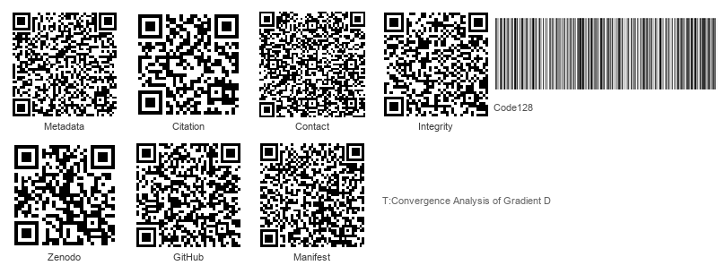
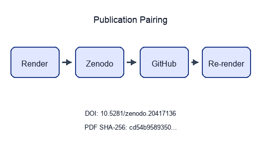

```{=latex}
\thispagestyle{empty}
\setlength{\parskip}{0pt}
\setlength{\itemsep}{0pt}
\begin{samepage}
\scriptsize
```

```{=latex}
\section*{BEGINNING OF TRANSMISSION}\label{beginning-of-transmission}
```

**State:** published

**Pairing:** complete (DOI, GitHub, SHA-256, Zenodo URL)

```{=latex}
\subsubsection*{Release metadata}
```

| Field | Value |
| --- | --- |
| Title | Convergence Analysis of Gradient Descent Optimization |
| Version | 2.5.2 |
| Concept DOI | 10.5281/zenodo.20417136 |
| Version DOI | 10.5281/zenodo.20931934 |
| GitHub | [https://github.com/docxology/template_code_project/releases/tag/v2.5.2](https://github.com/docxology/template_code_project/releases/tag/v2.5.2) |
| Zenodo | [https://zenodo.org/records/20417136](https://zenodo.org/records/20417136) |
| SHA-256 | `cd54b95893501467…` |
| SHA-512 | pending |

```{=latex}
\subsubsection*{How to verify}
```

- Scan **Integrity** QR and compare the embedded SHA-256 prefix to the table above.
- Scan **Zenodo** / **GitHub** QR codes and confirm they resolve to this release pairing.
- Full hashes and structured fields: `../data/transmission_manifest.json`.

{width=98%}

Structured manifest: `../data/transmission_manifest.json`

{width=35%}

**Stego:** on | overlays text | barcodes on | XMP on | manifest on → `./secure_run.sh`

```{=latex}
\end{samepage}
\newpage
```


<!-- BEGINNING OF TRANSMISSION -->