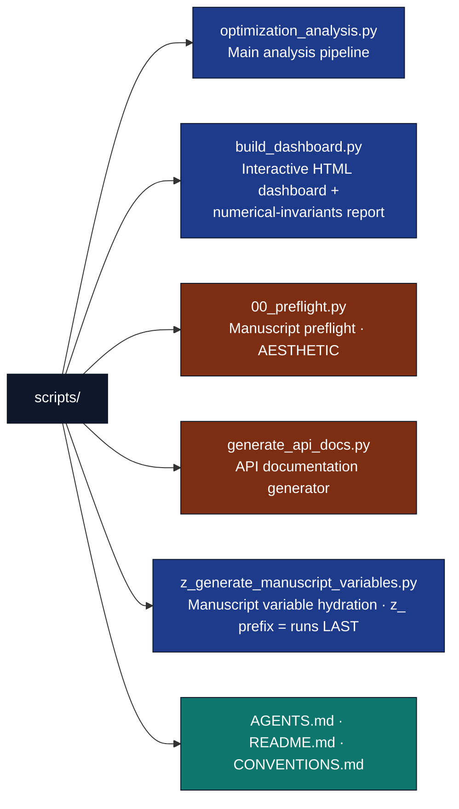

# scripts/ - Analysis Scripts

## Overview

The `scripts/` directory contains **Thin Orchestrators**. In the context of the Generalized Research Template, a "Thin Orchestrator" is a script that *strictly coordinates* business logic without implementing it directly. All complex scientific operations must reside in the thoroughly tested `src/` directory. The scripts here solely import from `src/` and hook into the `infrastructure/` modules to perform analysis, generate figures, and export data.

## Key Concepts

- **Thin Orchestrator Pattern**: Scripts act as glue. They compose functions from `src/` and pass the results to `infrastructure.scientific` and `infrastructure.reporting`, but they never perform data mutations or complex math themselves.
- **Integration examples**: Demonstrates how to use `src/` modules securely in research workflows.
- **Automated figure generation**: Scripts generate publication-ready figures via `infrastructure.rendering`.
- **Data export**: Structured data output for deterministic tracking.
- **Alphabetical ordering hints (`y_*`, `z_*`)**: scripts whose filenames start with a letter prefix run **after** any plainly-named script (alphabetical order). `z_generate_manuscript_variables.py` consumes outputs from `optimization_analysis.py` (figures, data, reports) and emits `{{TOKEN}}` substitutions — so it must run last. The alphabetical prefix is a human-readable hint for manual invocation; the canonical pipeline (`scripts/execute_pipeline.py`) enforces ordering via stage definitions, not filename. A forker introducing a script that should run between analysis and variable-hydration should name it `y_…` or rely on the pipeline stage list.
- **`z_generate_manuscript_variables.py` strict mode**: default invocation calls `generate_variables(..., require_analysis_outputs=True)` and fails when `output/data/optimization_results.csv` is absent. Use `--allow-draft` for early manuscript drafts that intentionally use `"N/A"` fallbacks.

## Directory Structure



## Installation/Setup

Scripts require the project dependencies:

- `numpy` - Numerical computations
- `matplotlib` - Plotting and visualization
- `infrastructure` - Template utilities (optional, for figure registration)

## Usage Examples

### Running the Analysis

```bash
# From projects/templates/template_code_project/
uv run python scripts/optimization_analysis.py
```

This script:

1. Runs optimization experiments with different step sizes (with progress tracking)
2. Generates convergence plots and analysis visualizations
3. Saves numerical results to CSV and analysis data
4. Performs numerical stability assessment and performance benchmarking
5. Creates HTML dashboard with analysis metrics
6. Registers figures with the manuscript system
7. Generates publishing materials and citations
8. Tracks performance metrics and resource usage
9. Provides error handling with recovery suggestions

### Manual Script Execution

```python
import sys
from pathlib import Path

# Add project paths
project_root = Path(__file__).parent.parent
sys.path.insert(0, str(project_root / "src"))

# Import and run analysis
from optimization_analysis import main
main()
```

## Configuration

Scripts use hardcoded parameters for reproducibility:

- **Step sizes**: `[0.01, 0.05, 0.1, 0.2]` for convergence comparison
- **Initial point**: `[0.0]` for 1D optimization
- **Plot settings**: 300 DPI, tight bounding box
- **Output directories**: `output/figures/`, `output/data/`

## Testing

Scripts are tested through the project test suite:

```bash
# Run all project tests (includes script integration tests)
uv run pytest ../tests/ -v

# Run specific analysis tests
uv run pytest ../tests/test_analysis_integration.py -k "TestStabilityAnalysis or TestPerformanceBenchmarking" -v

# Auxiliary script smoke (non-gated AESTHETIC scripts)
uv run pytest ../tests/test_scripts_smoke.py -v
```

**Auxiliary smoke coverage:** [`tests/test_scripts_smoke.py`](../tests/test_scripts_smoke.py) subprocess-invokes `generate_api_docs.py` (expects exit 0 and `output/docs/api_reference.md`) and `00_preflight.py` (accepts exit 0 or 1 when the local Puppeteer cache is absent; asserts actionable preflight diagnostics). Neither script is pipeline-required.

## API Reference

### generate_api_docs.py

Thin wrapper (~35 lines) delegating to [`src/documentation.py`](../src/documentation.py):

- `build_api_reference_markdown()` — static API reference template
- `run_api_doc_generation(project_root)` — writes `output/docs/api_reference.md` and optional glossary index

Unit tests: [`tests/test_documentation.py`](../tests/test_documentation.py). Subprocess smoke: [`tests/test_scripts_smoke.py`](../tests/test_scripts_smoke.py).

### optimization_analysis.py

Thin wrapper (~65 lines) — re-exports and `main()` only. **All API signatures live in [`../src/AGENTS.md`](../src/AGENTS.md):**

| Concern | Module |
| --- | --- |
| Convergence experiments, stability, benchmarking | [`src/analysis/`](../src/analysis/) |
| Matplotlib figures | [`src/figures/`](../src/figures/) |
| Core optimizer | [`src/optimizer.py`](../src/optimizer.py) |
| Dashboard HTML | [`src/dashboard.py`](../src/dashboard.py) via `build_dashboard.py` |

Run: `uv run python scripts/optimization_analysis.py` from the project root.

### build_dashboard.py

Thin wrapper → [`src/dashboard.py`](../src/dashboard.py). See [`../src/AGENTS.md`](../src/AGENTS.md).

### 00_preflight.py

Thin wrapper → [`infrastructure.rendering.preflight`](../../../../infrastructure/rendering/preflight.py).

### z_generate_manuscript_variables.py

Thin wrapper → [`src/manuscript_variables.py`](../src/manuscript_variables.py).

## Infrastructure Integration

### Performance Monitoring

The script uses infrastructure-backed performance monitoring:

```python
from infrastructure.core import monitor_performance

with monitor_performance("Optimization analysis pipeline") as monitor:
    # Main analysis execution
    results = run_analysis()

# Performance metrics are automatically logged
performance_metrics = monitor.stop()
```

### Error Handling Patterns

Comprehensive error handling with recovery suggestions:

```python
try:
    # Main execution
    main_analysis()
except ScriptExecutionError as e:
    print(f"Script execution failed: {e}")
    if e.recovery_commands:
        print("Recovery commands:")
        for cmd in e.recovery_commands:
            print(f"  {cmd}")
except TemplateError as e:
    print(f"Infrastructure error: {e}")
    if e.suggestions:
        print("Suggestions:")
        for suggestion in e.suggestions:
            print(f"  • {suggestion}")
```

### Progress Tracking

Visual progress indicators for long-running operations:

```python
from infrastructure.core.progress import ProgressBar

# Progress tracking for experiments
progress = ProgressBar(total=4, task="Step sizes")
for step_size in [0.01, 0.05, 0.1, 0.2]:
    result = run_single_experiment(step_size)
    progress.update(1)
progress.finish()
```

### Publishing Integration

Automated citation generation and metadata extraction:

```python
# Extract metadata from optimization results
metadata = extract_optimization_metadata(results)

# Generate citations in multiple formats
citations = generate_citations_from_metadata(metadata)

# Citations are saved to output/citations/ directory
```

### Structured Logging

Infrastructure-backed logging with operation timing:

```python
from infrastructure.core.logging.utils import log_operation, log_success

with log_operation("Running convergence experiments", logger=logger):
    results = run_convergence_experiment()

log_success("Analysis completed successfully!", logger=logger)
```

## Troubleshooting

### Common Issues

- **Import errors**: Ensure script is run from project root directory
- **Path issues**: Scripts assume standard project directory structure
- **Missing infrastructure**: Figure registration fails gracefully if infrastructure unavailable

### Debug Tips

Add debug output to scripts:

```python
import logging
logging.basicConfig(level=logging.DEBUG)
```

## Best Practices

- **Path handling**: Use `pathlib.Path` for cross-platform compatibility
- **Error handling**: Scripts should handle missing infrastructure gracefully
- **Output validation**: Verify generated files exist and have content
- **Reproducibility**: Use fixed parameters for consistent results

## See Also

- [README.md](README.md) - Quick reference
- [../src/optimizer.py](../src/optimizer.py) - Core algorithms used by scripts
