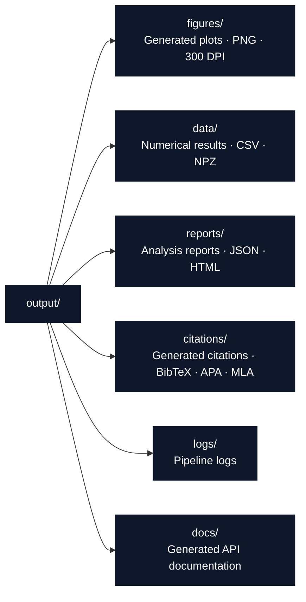

# Script Conventions

Orchestration rules and integration patterns for `scripts/` in the `template_code_project` exemplar.

## Thin Orchestrator Rules

Scripts **coordinate** — they never **compute**:

```python
# ✅ CORRECT: Script imports and orchestrates
from src.optimizer import gradient_descent, quadratic_function, compute_gradient
from infrastructure.core.logging.utils import get_logger

logger = get_logger(__name__)

result = gradient_descent(
    initial_point=np.array([5.0]),
    objective_func=quadratic_function,
    gradient_func=compute_gradient,
    step_size=0.1,
)
logger.info(f"Converged in {result.iterations} iterations")
```

```python
# ❌ WRONG: Script implements math directly
def my_gradient_descent(x, lr):
    for i in range(1000):
        grad = 2 * x  # Math belongs in src/
        x = x - lr * grad
    return x
```

If you find yourself writing math in `scripts/`, move it to `src/` first.

## Import Patterns

```python
import sys
from pathlib import Path

# 1. Standard library imports
import logging
import json

# 2. Third-party imports
import numpy as np
import matplotlib.pyplot as plt

# 3. Project source imports (via pythonpath)
from src.optimizer import gradient_descent, OptimizationResult

# 4. Infrastructure imports (graceful fallback)
try:
    from infrastructure.core.logging.utils import get_logger
    logger = get_logger(__name__)
except ImportError:
    logger = logging.getLogger(__name__)
```

- Always handle missing infrastructure gracefully with `try/except ImportError`
- Use explicit imports (not `from module import *`)

## Output Directory Structure

Scripts must write to the standard output layout:



```python
# Standard output path setup
project_dir = Path(__file__).parent.parent
output_dir = project_dir / "output"

figures_dir = output_dir / "figures"
data_dir = output_dir / "data"
reports_dir = output_dir / "reports"

for d in [figures_dir, data_dir, reports_dir]:
    d.mkdir(parents=True, exist_ok=True)
```

## Error Handling with Recovery

```python
try:
    results = run_analysis()
except Exception as e:
    logger.error(f"Analysis failed: {e}")
    logger.info("Recovery: try running with --verbose for diagnostics")
    sys.exit(1)
```

- Log errors with `logger.error()`, never `print()`
- Provide actionable recovery suggestions
- Use `sys.exit(1)` for fatal errors, not bare `raise`

## Progress Tracking

```python
from infrastructure.core.progress import ProgressBar

step_sizes = [0.01, 0.05, 0.1, 0.2]

progress = ProgressBar(total=len(step_sizes), task="Experiments")
for step_size in step_sizes:
    result = run_experiment(step_size)
    progress.update(1)
progress.finish()
```

- Use `ProgressBar` for any loop with >3 iterations
- Set a descriptive `task=` label

## Infrastructure Integration Checklist

Before submitting a new or modified script, verify:

- [ ] All math lives in `src/`, not in the script
- [ ] Uses `get_logger(__name__)` (not `print()`)
- [ ] Handles missing infrastructure with `try/except ImportError`
- [ ] Writes output to standard `output/` subdirectories
- [ ] Uses `Path` objects (not string concatenation) for file paths
- [ ] Has progress tracking for long-running loops
- [ ] Includes error handling with recovery suggestions
- [ ] Registers generated figures with the manuscript system

## See Also

- [AGENTS.md](AGENTS.md) — Full API reference for all script functions
- [../src/STYLE.md](../src/STYLE.md) — Style guide for the code scripts import
- [../docs/architecture.md](../docs/architecture.md) — Thin orchestrator flow diagram
