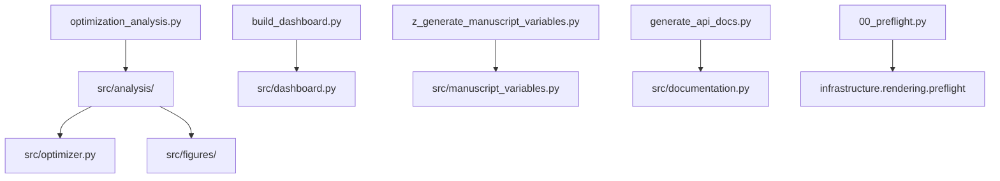

# scripts/ - Analysis Scripts

**Thin Orchestrators** demonstrating strict integration patterns. As per the Generalized Research Template policy, these scripts *do not contain core logic*. They only import from the `src/` directory and bridge results into the `infrastructure/` components for logging, rendering, and reporting.

## Quick Start

```bash
# Run analysis pipeline
uv run python scripts/optimization_analysis.py

# View generated outputs
ls -la ../output/
```

## Key Features

- **analysis pipeline** (experiments + visualization)
- **Automated figure generation** (convergence plots)
- **Data export** (optimization results to CSV)
- **Manuscript integration** (figure registration)

## Common Commands

### Run Analysis

```bash
uv run python optimization_analysis.py
```

Executes optimization experiments and generates all outputs.

### Check Outputs

```bash
ls -la ../output/figures/
ls -la ../output/data/
```

## Scripts

| Script | Role | Pipeline |
| --- | --- | --- |
| `optimization_analysis.py` | Main analysis pipeline (experiments, figures, reports) | Required |
| `build_dashboard.py` | Interactive HTML dashboard + invariants report | Required |
| `z_generate_manuscript_variables.py` | Manuscript `{{TOKEN}}` hydration (runs last; `z_` prefix) | Required |
| `generate_api_docs.py` | Writes `output/docs/api_reference.md` | AESTHETIC (smoke-tested) |
| `00_preflight.py` | Puppeteer/mmdc pre-render warning | AESTHETIC (smoke-tested; exit 0 or 1) |

Full API and smoke-test notes: [`AGENTS.md`](AGENTS.md).

## Architecture



## More Information

See [AGENTS.md](AGENTS.md) for technical documentation.
