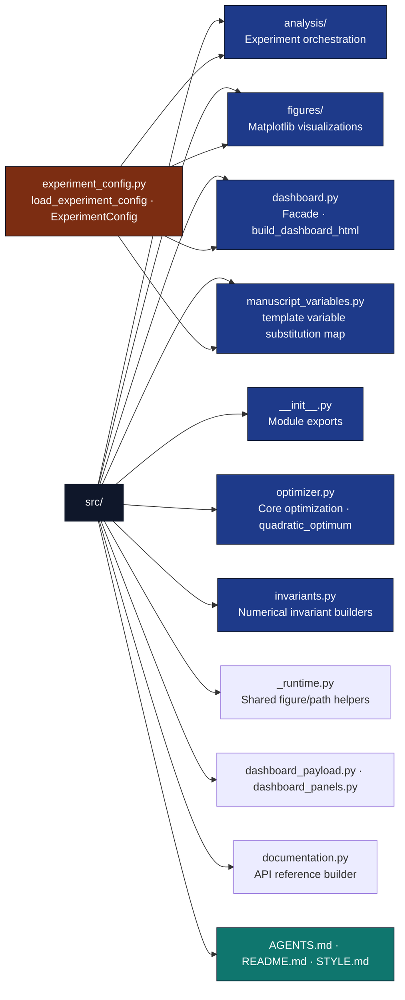

# src/ - Core Optimization Algorithms

## Overview

The `src/` directory contains the importable project logic for the research project. The mathematical layer (`optimizer.py`, `invariants.py`) remains pure and deterministic; generated-output workflows (`analysis/`, `figures/`, `dashboard.py`, `manuscript_variables.py`, `documentation.py`) live here so scripts stay thin CLI wrappers. Experiment parameters are loaded once from `manuscript/config.yaml` → `experiment:` via `experiment_config.py` and shared by analysis, figures, dashboard, and manuscript variable generation.

## Key Concepts

- **Pure Scientific Core**: Optimizer functions must be side-effect-free. They solely take inputs and return outputs.
- **Importable Project Workflows**: Analysis/dashboard/manuscript-variable modules may perform explicit file I/O and infrastructure calls, but scripts should only delegate to them.
- **Zero-Mock Testability**: Pure functions are tested exhaustively with real data; workflow modules are tested through real temp files, subprocesses, and generated artifacts.
- **Mathematical optimization** algorithms for parameter tuning
- **Reproducible research** via deterministic, functional design
- **Numerical stability** and convergence analysis
- **Type safety** with comprehensive type hints

## Directory Structure



## Installation/Setup

This module uses standard scientific Python libraries:

- `numpy` - Numerical computations and arrays
- `scipy` - Scientific computing utilities
- `matplotlib` - Plotting and visualization

## Infrastructure Integration

The optimizer core is **infrastructure-independent**: `optimizer.py` and `invariants.py` must not import `infrastructure.*`. Coupling to infrastructure (logging configuration, benchmarking, stability analysis, validation, rendering) belongs in importable workflow modules such as `analysis/` and `dashboard.py`, with `scripts/` acting as wrappers.

### Available Infrastructure Capabilities

- **Scientific Analysis**: `infrastructure.scientific` - Numerical stability and performance benchmarking
- **Logging**: `infrastructure.core.logging.utils` - Structured logging configuration used by scripts/pipeline (not by `src/`)
- **Validation**: `infrastructure.validation` - Output integrity and quality checks
- **Rendering**: `infrastructure.rendering` - Multi-format output generation
- **Publishing**: `infrastructure.publishing` - Academic publishing workflows

### Integration Examples

#### Scientific Analysis Integration

```python
from optimizer import gradient_descent
from infrastructure.scientific import check_numerical_stability, benchmark_function
from infrastructure.core.logging.utils import get_logger

logger = get_logger(__name__)

# Define test problem
def objective(x): return (x[0] - 1)**2 + (x[1] - 2)**2
def gradient(x): return np.array([2*(x[0] - 1), 2*(x[1] - 2)])

# Run optimization
result = gradient_descent(np.array([0.0, 0.0]), objective, gradient)

# Analyze numerical stability
stability = check_numerical_stability(
    func=objective,
    test_inputs=[np.array([0.0, 0.0]), result.solution]
)
logger.info(f"Stability score: {stability['overall_stable']}")

# Benchmark performance
benchmark = benchmark_function(
    func=lambda x: gradient_descent(x, objective, gradient).iterations,
    test_inputs=[np.array([0.0, 0.0])]
)
logger.info(f"Average iterations: {benchmark['mean_time']:.1f}")
```

#### Validation Integration

```python
from infrastructure.validation import verify_output_integrity

# After generating optimization results
output_dir = Path("output")
integrity_report = verify_output_integrity(output_dir)

if integrity_report.issues:
    logger.warning(f"Found {len(integrity_report.issues)} integrity issues")
else:
    logger.info("Output integrity validation passed")
```

## Usage Examples

### Basic Optimization

```python
from optimizer import gradient_descent, quadratic_function, compute_gradient

# Define objective function
def objective(x):
    return quadratic_function(x, A=np.eye(len(x)), b=np.ones(len(x)))

def gradient(x):
    return compute_gradient(x, A=np.eye(len(x)), b=np.ones(len(x)))

# Run optimization
result = gradient_descent(
    initial_point=np.array([0.0, 0.0]),
    objective_func=objective,
    gradient_func=gradient,
    step_size=0.1
)

print(f"Optimal point: {result.solution}")
print(f"Objective value: {result.objective_value}")
```

### Custom Optimization Problems

```python
# Define custom objective and gradient
def custom_objective(x):
    return (x[0] - 1)**2 + (x[1] - 2)**2

def custom_gradient(x):
    return np.array([2*(x[0] - 1), 2*(x[1] - 2)])

result = gradient_descent(
    initial_point=np.array([5.0, 5.0]),
    objective_func=custom_objective,
    gradient_func=custom_gradient
)
```

## Configuration

The optimization algorithms support configuration through function parameters:

- **step_size**: Learning rate for gradient descent (default: 0.01)
- **max_iterations**: Maximum iterations before termination (default: 1000)
- **tolerance**: Convergence tolerance for gradient norm (default: 1e-6)
- **verbose**: Enable progress printing (default: False)

## Testing

```bash
# Run all tests for this module
uv run pytest ../tests/ -v

# Run specific test classes
uv run pytest ../tests/ -k "TestQuadraticFunction"

# Run with coverage
uv run pytest ../tests/ --cov=. --cov-report=html
```

## API Reference

### experiment_config.py

#### ExperimentConfig (frozen dataclass)

Loaded from `manuscript/config.yaml` → `experiment:` by `load_experiment_config(project_root)`.
Shared by `analysis/`, `figures/`, `sweeps.py`, `dashboard.py`, and `manuscript_variables.py`.

### sweeps.py

Unified α-sweep and stability matrix used by `figures/sensitivity.py`, `dashboard.py`,
and `invariants.py` — do not duplicate sweep logic elsewhere.

### figures/ package

- `viz_config.py` — `VIZ_CONFIG`, `apply_visualization_style`, `agency_category`
- `figures/convergence.py`, `figures/sensitivity.py`, `figures/scientific.py` (barrel → `scientific_complexity.py`, `scientific_stability.py`)
- `figures/_common.py` — shim to `_runtime.py` for `project_root`, `get_logger`, `experiment_config`, `save_figure_data`
- `figures/__init__.py` — re-export barrel (`from src.figures import …`)

### analysis/ package

- `workflow.py` — full `run_analysis_pipeline` / `main` orchestration (tests import via `src.analysis.main`)
- `pipeline.py` — composable step exports only (no full-run orchestration)
- `experiments.py`, `scientific_reports.py`, `publishing.py`
- CLI lives in `../scripts/optimization_analysis.py` (thin wrapper)

### dashboard modules

- `dashboard_payload.py` — `compute_payload`, `load_yaml_defaults`, `to_diagonal_A`
- `dashboard_panels.py` — `build_dashboard`, Plotly panel assembly
- `dashboard.py` — facade re-exports + `build_dashboard_html(project_root) -> Path`
- CLI in `../scripts/build_dashboard.py`

### _runtime.py

Shared helpers for figure generators: `project_root(caller)`, `get_logger`, `experiment_config`, `save_figure_data`. Analysis infra/logging remain in `analysis/_infra.py` and `analysis/_logging.py`.

Key fields: `step_sizes`, `quadratic_A`, `quadratic_b`, `initial_point`, `max_iterations`,
`tolerance`, `convergence_tolerance`, `stability_starting_points`, `stability_step_sizes`,
`benchmark_dimensions`. Helpers: `A_array()`, `b_array()`, `to_optimizer_sweep_config()`.

#### load_experiment_config (function)

```python
def load_experiment_config(project_root: Path | None = None) -> ExperimentConfig:
    """Parse ``experiment:`` from ``manuscript/config.yaml`` with typed defaults."""
```

### manuscript_variables.py

#### generate_variables (function)

```python
def generate_variables(
    project_root: Path,
    *,
    require_analysis_outputs: bool = False,
) -> dict[str, str]:
    """Build the flat ``UPPERCASE_KEY → value`` map for ``{{TOKEN}}`` injection.

    When ``require_analysis_outputs`` is True (default pipeline path via
    ``scripts/z_generate_manuscript_variables.py``), missing
    ``output/data/optimization_results.csv`` raises ``FileNotFoundError`` instead
    of emitting ``"N/A"`` for result-derived tokens. Pass ``--allow-draft`` to the
    script for draft renders without analysis outputs.
    """
```

#### save_variables (function)

```python
def save_variables(variables: dict[str, str], output_path: Path) -> Path:
    """Write ``manuscript_variables.json`` for rendering and debugging."""
```

### optimizer.py

#### quadratic_optimum (function)

```python
def quadratic_optimum(A: np.ndarray, b: np.ndarray) -> tuple[np.ndarray, float]:
    """Analytical minimizer for f(x) = (1/2) x^T A x - b^T x. Returns (x*, f*)."""
```

#### OptimizationResult (dataclass)

```python
@dataclass
class OptimizationResult:
    """Result of an optimization run.

    Attributes:
        solution: np.ndarray - Final solution point
        objective_value: float - Objective function value at solution
        iterations: int - Number of iterations performed
        converged: bool - Whether convergence criteria were met
        gradient_norm: float - Final gradient norm
        objective_history: Optional[list[float]] - Objective values at each iteration
    """
```

#### quadratic_function (function)

```python
def quadratic_function(
    x: np.ndarray,
    A: Optional[np.ndarray] = None,
    b: Optional[np.ndarray] = None
) -> float:
    """Evaluate quadratic function f(x) = (1/2) x^T A x - b^T x.

    Args:
        x: Input point (n-dimensional vector)
        A: Positive definite matrix (n x n), defaults to identity
        b: Linear term vector (n-dimensional), defaults to ones

    Returns:
        Function value at x

    Raises:
        ValueError: If dimensions don't match
    """
```

#### compute_gradient (function)

```python
def compute_gradient(
    x: np.ndarray,
    A: Optional[np.ndarray] = None,
    b: Optional[np.ndarray] = None
) -> np.ndarray:
    """Compute gradient of quadratic function.

    Args:
        x: Input point
        A: Quadratic term matrix
        b: Linear term vector

    Returns:
        Gradient vector at x
    """
```

#### gradient_descent (function)

```python
def gradient_descent(
    initial_point: np.ndarray,
    objective_func: Callable[[np.ndarray], float],
    gradient_func: Callable[[np.ndarray], np.ndarray],
    max_iterations: int = 1000,
    tolerance: float = 1e-6,
    step_size: float = 0.01,
    verbose: bool = False
) -> OptimizationResult:
    """Perform gradient descent optimization.

    Args:
        initial_point: Starting point for optimization
        objective_func: Function to minimize
        gradient_func: Gradient function
        max_iterations: Maximum number of iterations
        tolerance: Convergence tolerance for gradient norm
        step_size: Fixed step size for updates
        verbose: Whether to print progress

    Returns:
        OptimizationResult with final solution and statistics
    """
```

## Troubleshooting

### Common Issues

- **Dimension mismatches**: Ensure A, b, and x have compatible dimensions
- **Non-convergence**: Try smaller step sizes or different initial points
- **Numerical instability**: Check condition number of matrix A

### Debug Tips

Enable verbose output to monitor optimization progress:

```python
result = gradient_descent(..., verbose=True)
```

### documentation.py

Markdown API reference builder for public `src/` symbols. Invoked by `scripts/generate_api_docs.py` (AESTHETIC); tested in `tests/test_documentation.py` and subprocess-smoke in `tests/test_scripts_smoke.py`.

## Best Practices

- **Scale variables** to similar magnitudes for better convergence
- **Choose appropriate step sizes** through experimentation
- **Monitor convergence** using gradient norms
- **Use multiple starting points** for global optimization problems

## See Also

- [README.md](README.md) - Quick reference
- [../scripts/optimization_analysis.py](../scripts/optimization_analysis.py) - Example usage
- [../tests/test_optimizer.py](../tests/test_optimizer.py) - tests
