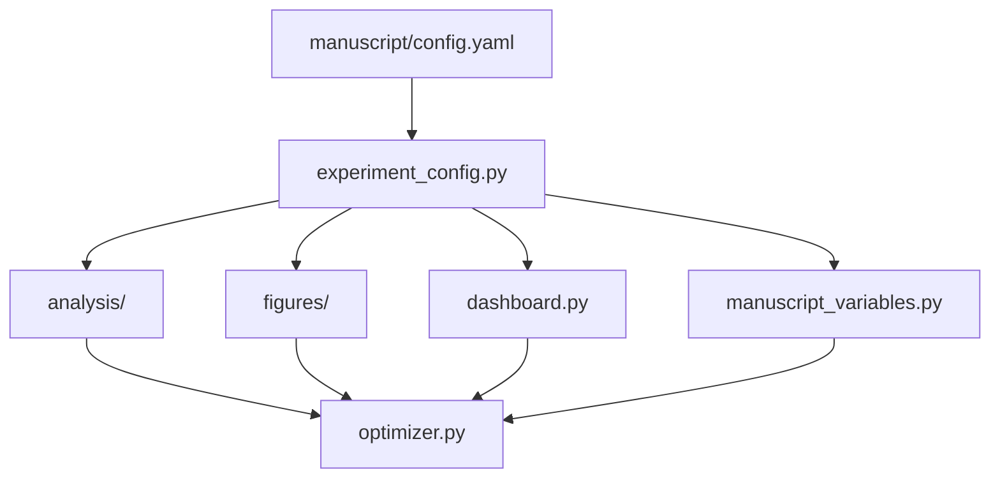

# src/ - Project Logic

Core optimization algorithms, shared experiment configuration, analysis builders, figure generators, dashboard payloads, and manuscript-variable extraction for the code exemplar. Mathematical primitives stay pure; generated-output workflows live in importable modules so scripts remain thin wrappers.

## Quick Start

```python
import logging

import numpy as np
from optimizer import gradient_descent, quadratic_function

logger = logging.getLogger(__name__)

# Simple optimization example
result = gradient_descent(
    initial_point=np.array([0.0]),
    objective_func=lambda x: quadratic_function(x),
    gradient_func=lambda x: x - 1,  # Gradient of f(x) = 0.5*x^2 - x
    step_size=0.1
)

logger.info(f"Optimal solution: {result.solution}")
```

## Key Features

- **Gradient descent** optimization algorithm
- **Quadratic function** evaluation, gradients, and analytical optimum (`quadratic_optimum`)
- **Shared experiment config** in `experiment_config.py` (single loader for `manuscript/config.yaml`)
- **Importable analysis pipeline** in `analysis/`
- **Matplotlib figures** in `figures/`
- **Plotly dashboard builder** in `dashboard.py`
- **Manuscript `{{TOKEN}}` map** in `manuscript_variables.py`
- **API reference builder** in `documentation.py` (invoked by `scripts/generate_api_docs.py`)
- **Reproducible results** with deterministic behavior
- **Type-safe** with type hints

## Common Commands

### Import and Use

```python
from experiment_config import load_experiment_config
from optimizer import (
    gradient_descent,
    quadratic_function,
    compute_gradient,
    quadratic_optimum,
    OptimizationResult,
)

cfg = load_experiment_config()
x_star, f_star = quadratic_optimum(cfg.A_array(), cfg.b_array())
```

### Run Tests

```bash
cd projects/templates/template_code_project
uv run pytest tests/ --cov=src --cov-fail-under=90
```

## Architecture



## More Information

See [AGENTS.md](AGENTS.md) for technical documentation.
