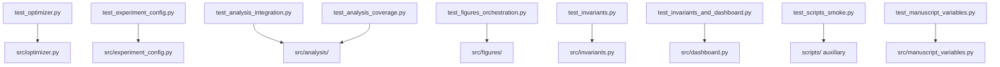

# tests/ - Zero-Mock Test Suite

An uncompromising validation layer for the mathematical algorithms and orchestration paths. Enforces a strict Zero-Mock policy.

## Quick Start

```bash
cd projects/templates/template_code_project
uv run pytest tests/ -v
uv run pytest tests/ --cov=src --cov-fail-under=90
```

## Key Features

- **Real data testing** (no mocks)
- **Numerical accuracy validation**
- **Integration tests** for analysis, figures, dashboard, and manuscript variables
- **Deterministic results**

## Test Files

| File | Focus |
| --- | --- |
| `test_optimizer.py` | Pure math (`optimizer.py`) |
| `test_analysis_integration.py` | Analysis orchestration, stability/benchmark |
| `test_analysis_coverage.py` | Analysis branch and error-path coverage |
| `test_experiment_config.py` | Shared config loader |
| `test_figures_orchestration.py` | Matplotlib generators |
| `test_dashboard_config.py` | Dashboard config + argparse validation |
| `test_invariants.py` | Invariant builders |
| `test_invariants_and_dashboard.py` | Dashboard CLI |
| `test_manuscript_variables.py` | `{{TOKEN}}` map + live cross-reference |
| `test_scripts_smoke.py` | Auxiliary scripts (`generate_api_docs.py`, `00_preflight.py`) |
| `test_documentation.py` | `documentation.py` API reference helpers |

Live test count and coverage: [`docs/_generated/COUNTS.md`](../../../../docs/_generated/COUNTS.md).

## Architecture



> **Zero-Mock Policy**: Tests use real numpy arrays, temp files, and generated artifacts. No `unittest.mock`, `MagicMock`, or `@patch`. Orchestration modules may use `pytest.MonkeyPatch` on module attributes and subprocess import isolation — see [`PATTERNS.md`](PATTERNS.md).

## More Information

See [AGENTS.md](AGENTS.md) for technical documentation.
